# Работа с Git

## 1. Проверка наличия установленного Git

В терминале выполнить команду 
```
git version
```
Если Git установлен, появится сообщение с информацией о версии программы. 

__*Например так:*__

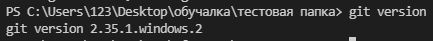

## 2. Установка Git

Загружаем поледнюю версю Git с сайта https://git-scm.com/downloads
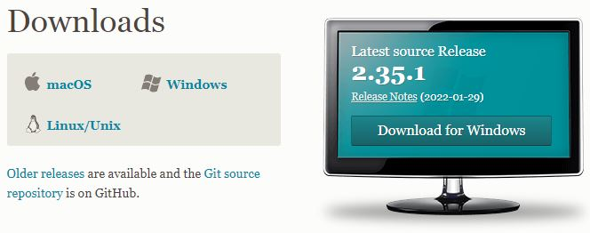

## 3. Настройка Git
При первом использовании git необходимо представиться

 Для этого ввести в терминале две команды: 
```
git config --global user.name "Ваше имя"
git config --global user.email "email@examlp.com"
```
Для проверки имени пользователя и почты можно ввести команду
```
git config --global --list
```
__*Например:*__
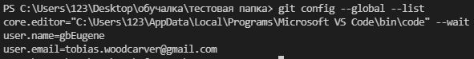

## 4. Создание репозитория

Для того, чтобы git начал ослеживать изменения в нашем файле, необходимо **инициализировать** нужную нам папку с файлами как репозиторий.

Для этого нужно перейти в папку в которой будем работать с файлами и из неё открыть `терминал`, следом ввести команду
```
git init
```
После чего можно создавать файлы в этой папке и git начнёт отслеживать изменения.

## 5. Работа с измениями файла

Чтобы проверить текущее состояние файла на наличие несохранённых изменений нужно ввести команду
```
git status
```
__*Например:*__
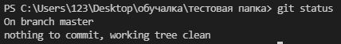

Это означает, что никаких сохранённых и отслеживаемых изменений нет.

Если будет сохранено какое-либо изменение но не добавлено к отслеживанию,

 __*то появится такое сообщение:*__
 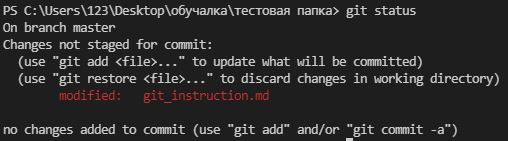

 Если же изменение сохранено и добавлено к отслеживанию, но не добавлено в коммит, то команда __*`git status`*__ выдаст следуюющее сообщение:
 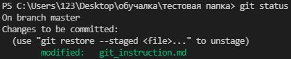


Для фиксации текущего стостояния файла для начала необходимо его сохранить через горячую клавишу **`ctrl+s`**, затем добавить его к отслеживанию через команду и указать название файла в котором фиксируется изменение
```
git add user.md\txt\...
```
После чего зафиксировать это изменение и добавить коментарий
```
git commit -m "messege"
```
__*Например:*__
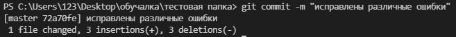


Чтобы увидеть отличие от сохранённой информации и зафиксированной через `commit`, необходимо ввести команду
```
git diff
```
__*К примеру нам могут показать что было удалено или добавлено:*__
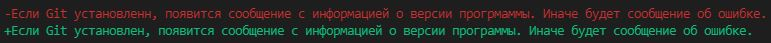

## 6. Работа с историями сохранений

Чтобы просмотреть все зафиксированные изменения достаточно ввести команду

```
git log
```
И при наличии имеющихся коммитов, __*появится следующее сообщение:*__
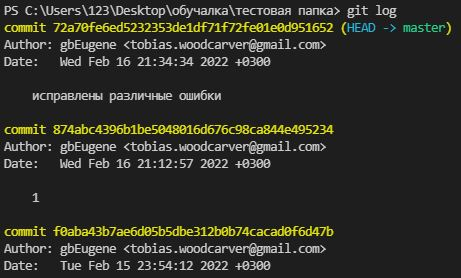 

Для перехода в нужное нам состояние файла достаточно ввести команду 
```
git checkout (первые 4-6 символа кода commit нужного нам состояния выводимое при команде git log)
```
**`Важно! После всех переходов возвращаться в ветку master для дальнейшей работы.`** Сделать это можно следующей командой:
```
git checkout master
```
## 7. Ветви

*Ветви позволяют работать над черновыми версиями файла до его окончательного состояния*

Какие же у нас есть ветви и на какой конкретно мы находимся мы можем с помощью **команды:**
```
git branch
```
После чего, если у нас имеются созданные ветви мы увидим это:
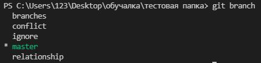

_**(*) помечается на какой ветви мы сейчас находимся**_

Для того чтобы создать отдельную ветвь, необходимо её как-нибудь назвать добавив имя ветви к команде указанной выше:
```
git branch "name"
```
Для перемещения между ветвями используют команду **`checkout`**
```
git checkout "name"
```

*Например:*
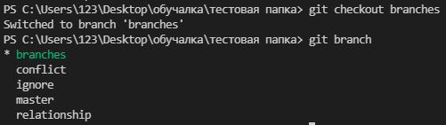

## 8. Взаимодействия с ветками
С ветками можно проводить различные операции
1. Сливать две ветки вместе, используя **`команду:`**
```
git merge "name"
```
при успешном выполнении операции появится следующее сообщение:
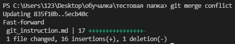
*Иначе возниктнет конфликт, который придётся разрешить.*

2. Удалить ненужную нам ветку, используя **`команду:`**
```
git branch -d "name"
```
После чего система оповестит о выполненой операции:
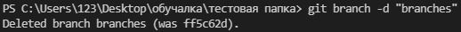

3. Так же можно увидеть визуальное представление об имеющихся ветках и сделанных там коммитах через команду
```
git log --graph
```
Вот в таком виде:
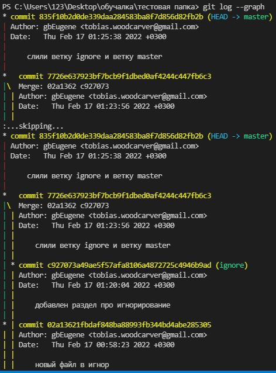

## 9. Игнорирование файлов
Для того чтобы git не отслеживал какой-либо файл (`например, изображение`), нужно сперва сперва добавить его в наш репозиторий, а затем создать файл без названия с расширением **`.gitignore`**


Затем, списком, перечислит все файлы которые `git` должен игнорировать, *при этом писать название файла полностью и с расширением*

**`Например:`**

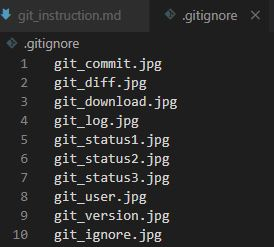

В выпадающем списке слева цветом помеченые игнорируемые(или нет) файлы
-серый - игнорирует
-зелёный - нет
-красный - ошибка\конфликт

**`Например:`**

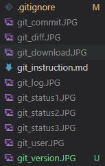

После этого сохранить изменения, добавить к отслеживанию и закоммитеть.

## 10. Конфликты и их устранение.

Конфликт может возникнуть, когда мы сливаем две ветки, имея в одном месте информацию.

В таком случае мы получил от системы соответсвующее сообщение, а сам файл будет подсвечен красным, оповещая об имеющимся конфликте:


А в самом теле файла появится два окна с двумя разными вариантами информации, предлагая нам выбрать:

* оставить ту информацию что уже имеется
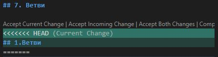
* оставить загружаемую информацию

* или оставить оба варината и отредактировать вручную.

В любом из принятых и устраиваемых вариантов остаётся, только сохранить файл, добавить к отслеживанию и закоммитеть.